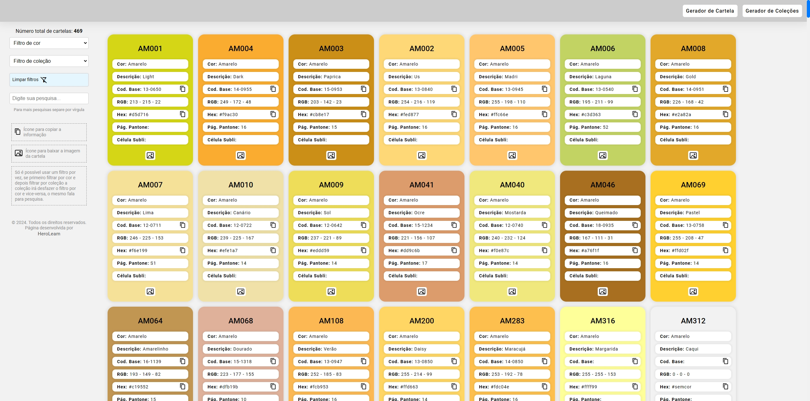
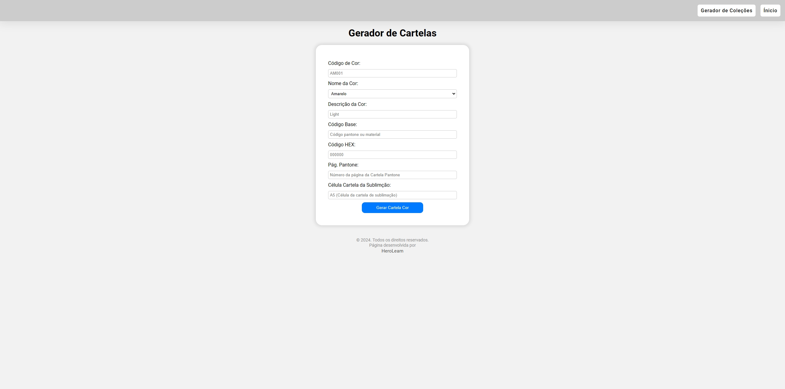
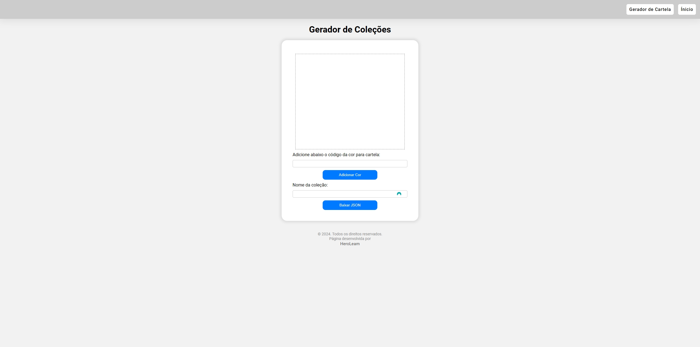

# Cartela de cores

 

# Sobre o projeto

O site que desenvolvi é um catálogo de cores, que permite aos usuários explorar e selecionar cores para seus projetos. Ele inclui filtros para cores e filtros para coleções, que são conjuntos de cores relacionadas. Além disso, há uma barra de pesquisa para facilitar a busca por cores específicas.

Uma das principais funcionalidades do site é o criador de cores, onde os usuários podem preencher um formulário com informações sobre a cor desejada. O site gera automaticamente um arquivo HTML para baixar, contendo as informações da cor. Esse arquivo pode ser adicionado à pasta do projeto (assets/colorChart), e a cor será automaticamente carregada no site.

Além disso, o site possui um gerador de coleções, onde os usuários podem informar o código da cor para adicionar a uma coleção. Assim como no criador de cores, o arquivo gerado deve ser adicionado à pasta do projeto (assets/collections) para que a coleção apareça como filtro no site.

## Layout web principal

## Layout web gerador de cor/cartela

## Layout web gerador de coleção/filtro

# Tecnologias utilizadas
## Front end
- HTML
- CSS
- JavaScript

# Autor

Thiago Leoni Amaral aka Heroleam

https://heroleam.github.io/herofield